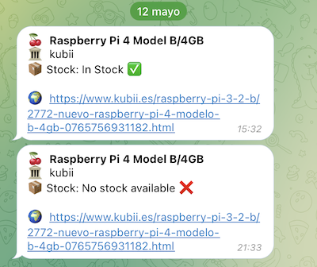

# piscrape: a telegram bot for notifying Raspberry Pi 4 stock on official Spanish distributors

<p align="center">

</p>
This python script is designed to be ran each time updates are wanted
(it doesn't stay running forever). The execution of the script is managed by a systemd unit and timer.

## Requirements

A custom telegram bot needs to be created for telegram integration

For running this script you will need to create a new `.env` file at the same folder as the `main.py` with the following content:

```properties
TG_API_TOKEN="XXXXXXX:YYYYYYYYYYYYY"
CHAT_ID="ZZZZZZ"
```
## Extra

A makefile is included for service installation and python environment setup

URLs for each model and distributor are provided at `sources.json`
